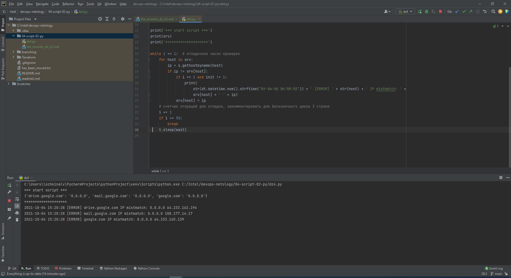

# Домашнее задание к занятию "4.2. Использование Python для решения типовых DevOps задач"

## Обязательные задания

1. Есть скрипт:
    ```python
    #!/usr/bin/env python3
    a = 1
    b = '2'
    c = a + b
    ```
    * Какое значение будет присвоено переменной c?
    * Как получить для переменной c значение 12?
    * Как получить для переменной c значение 3?
   
   ####Ответ:
     * будет ошибка, т.к. типы не соответсвуют для операции , _int_ и _str_
     * привести a к строке:       _c=str(a)+b_
     * привести b к целому числу: _c=a+int(b)_

    
2. Мы устроились на работу в компанию, где раньше уже был DevOps Engineer. Он написал скрипт, позволяющий узнать, какие файлы модифицированы в репозитории, относительно локальных изменений. Этим скриптом недовольно начальство, потому что в его выводе есть не все изменённые файлы, а также непонятен полный путь к директории, где они находятся. Как можно доработать скрипт ниже, чтобы он исполнял требования вашего руководителя?

    ```python
    #!/usr/bin/env python3

    import os

    bash_command = ["cd ~/netology/sysadm-homeworks", "git status"]
    result_os = os.popen(' && '.join(bash_command)).read()
    is_change = False
    for result in result_os.split('\n'):
        if result.find('modified') != -1:
            prepare_result = result.replace('\tmodified:   ', '')
            print(prepare_result)
            break

    ```
    ####Ответ:
     * Лишняя логическая переменная is_change и команда breake которая прерывает обработку при первом же найденом вхождении

   ```python 
    #!/usr/bin/env python3

    import os

    bash_command = ["cd ~/devops-netology", "git status"]
    result_os = os.popen(' && '.join(bash_command)).read()
    #is_change = False
    for result in result_os.split('\n'):
        if result.find('modified') != -1:
            prepare_result = result.replace('\t:   ', '')
            print(prepare_result)
            #break
    ``` 
3. Доработать скрипт выше так, чтобы он мог проверять не только локальный репозиторий в текущей директории, а также умел воспринимать путь к репозиторию, который мы передаём как входной параметр. Мы точно знаем, что начальство коварное и будет проверять работу этого скрипта в директориях, которые не являются локальными репозиториями.
    ####Ответ: 
    * Добавил обработку аргумента (считаем что аргумент единственный и дает нам нужную команду)
   ```python
    #!/usr/bin/env python3

    import os
    import sys

    cmd = sys.argv[1]
    bash_command = ["cd "+cmd, "git status"]
    result_os = os.popen(' && '.join(bash_command)).read()
    #is_change = False
    for result in result_os.split('\n'):
        if result.find('modified') != -1:
            prepare_result = result.replace('\tmodified: ', '')
        # добавил замену всех оставшихся пробелов в строке для удобства вывода
            prepare_result = prepare_result.replace(' ', '') 
            print(cmd+prepare_result)
            #break
    ```
4. Наша команда разрабатывает несколько веб-сервисов, доступных по http. Мы точно знаем, что на их стенде нет никакой балансировки, кластеризации, за DNS прячется конкретный IP сервера, где установлен сервис. Проблема в том, что отдел, занимающийся нашей инфраструктурой очень часто меняет нам сервера, поэтому IP меняются примерно раз в неделю, при этом сервисы сохраняют за собой DNS имена. Это бы совсем никого не беспокоило, если бы несколько раз сервера не уезжали в такой сегмент сети нашей компании, который недоступен для разработчиков. Мы хотим написать скрипт, который опрашивает веб-сервисы, получает их IP, выводит информацию в стандартный вывод в виде: <URL сервиса> - <его IP>. Также, должна быть реализована возможность проверки текущего IP сервиса c его IP из предыдущей проверки. Если проверка будет провалена - оповестить об этом в стандартный вывод сообщением: [ERROR] <URL сервиса> IP mismatch: <старый IP> <Новый IP>. Будем считать, что наша разработка реализовала сервисы: drive.google.com, mail.google.com, google.com.
    ####Ответ: 
      * Дополнил вывод временем, и инициализацией 1ой итерацией без проверки
    ```python
      ##!/usr/bin/env python3

      import socket as s
      import time as t
      import datetime as dt

      # set variables 
      i = 1
      wait = 5 # интервал проверок в секундах
      srv = {'drive.google.com':'0.0.0.0', 'mail.google.com':'0.0.0.0', 'google.com':'0.0.0.0'}
      init=0

      print('*** start script ***')
      print(srv)
      print('********************')

      while 1==1 : #отладочное число проверок 
        for host in srv:
         ip = s.gethostbyname(host)
         if ip != srv[host]:
           if i==1 and init !=1:
             print(str(dt.datetime.now().strftime("%Y-%m-%d %H:%M:%S")) +' [ERROR] ' + str(host) +' IP mistmatch: '+srv[host]+' '+ip)
           srv[host]=ip
      # счетчик итераций для отладки, закомментировать для бесконечного цикла 3 строки
        i+=1 
        if i >= 50 : 
          break
        t.sleep(wait)
    ```
   Проверка:
