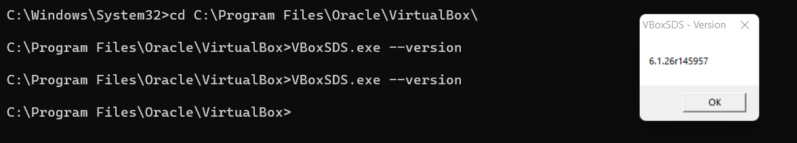

## Задача 1

####
- Опишите своими словами основные преимущества применения на практике IaaC паттернов.
```
1. Ускорение производства и вывода продукта на рынок за счет автоматизации.
2. Стабильность среды, устранение дрейфа конфигураци
3. Более быстрая и эффективная разработка за счет CI/CD
```

#### 
- Какой из принципов IaaC является основополагающим?
```
- Идемпоте́нтность
```

## Задача 2

####
- Чем Ansible выгодно отличается от других систем управление конфигурациями?
```
- Нет необходимости устанавливать специальную инфраструктуру открытого ключа (PKI)
```

####
- Какой, на ваш взгляд, метод работы систем конфигурации более надёжный push или pull?
```
- Pull. Исключает коллизии broadcast. Исключает возможность перхвата конфигурации (метод подмены клиента)
```

## Задача 3

Установить на личный компьютер:
###
- VirtualBox
```
В "винде " только так )

```
### 
- Vagrant
```
- c:\intel\vagrant>vagrant -v
- Vagrant 2.2.18
```
###
- Ansible
```
- root@vagrant:/home/vagrant# ansible --version
- ansible 2.9.9
```
*Приложить вывод команд установленных версий каждой из программ, оформленный в markdown.*

## Задача 4 (*)

Воспроизвести практическую часть лекции самостоятельно.

- Создать виртуальную машину.
- Зайти внутрь ВМ, убедиться, что Docker установлен с помощью команды
```
docker ps

```