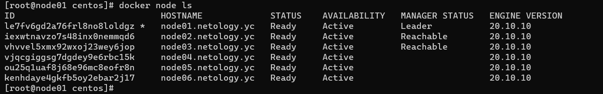

# Домашнее задание к занятию "5.5. Оркестрация кластером Docker контейнеров на примере Docker Swarm"

## Задача 1

Дайте письменые ответы на следующие вопросы:

- В чём отличие режимов работы сервисов в Docker Swarm кластере: replication и global?
```
Глобальный сервис — это сервис, который запускает одну задачу на каждой ноде. Предварительно заданного количества задач нет. Каждый раз, когда вы добавляете ноду в swarm, оркестратор создает задачу, а планировщик назначает задачу новой ноде.
```
```
Для реплицированного сервиса вы указываете, сколько идентичных задач хотите запустить. Например, вы решили развернуть сервис HTTP с тремя репликами, каждая из которых обслуживает один и тот же контент.
```
- Какой алгоритм выбора лидера используется в Docker Swarm кластере?
```
Лидер нода выбирается из управляющих нод путем Raft согласованного алгоритма.
```
- Что такое Overlay Network?
```
Логическая сеть созданная по вверх другой сети.
```

## Задача 2

Создать ваш первый Docker Swarm кластер в Яндекс.Облаке

Для получения зачета, вам необходимо предоставить скриншот из терминала (консоли), с выводом команды:
```
docker node ls
```

### Ответ
<p align="center">
  
</p>

## Задача 3

Создать ваш первый, готовый к боевой эксплуатации кластер мониторинга, состоящий из стека микросервисов.

Для получения зачета, вам необходимо предоставить скриншот из терминала (консоли), с выводом команды:
```
docker service ls
```
### Ответ
<p align="center">
  
</p>

## Задача 4 (*)

Выполнить на лидере Docker Swarm кластера команду (указанную ниже) и дать письменное описание её функционала, что она делает и зачем она нужна:
```
# см.документацию: https://docs.docker.com/engine/swarm/swarm_manager_locking/
docker swarm update --autolock=true
```
```
Включает автоблокировку кластера. Запрещает измененния в кластаре.
```
