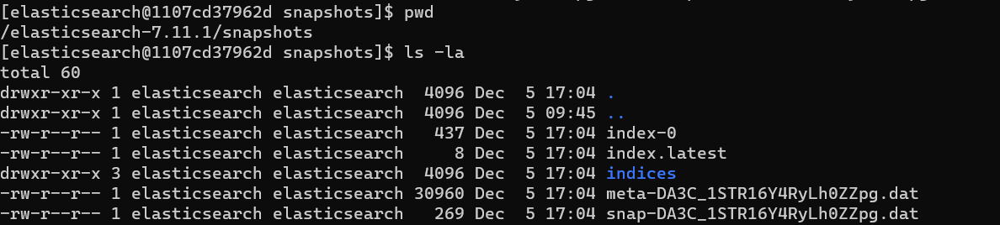

# Домашнее задание к занятию "6.5. Elasticsearch"

## Задача 1

В этом задании вы потренируетесь в:
- установке elasticsearch
- первоначальном конфигурировании elastcisearch
- запуске elasticsearch в docker

Используя докер образ [centos:7](https://hub.docker.com/_/centos) как базовый и 
[документацию по установке и запуску Elastcisearch](https://www.elastic.co/guide/en/elasticsearch/reference/current/targz.html):

- составьте Dockerfile-манифест для elasticsearch
- соберите docker-образ и сделайте `push` в ваш docker.io репозиторий
- запустите контейнер из получившегося образа и выполните запрос пути `/` c хост-машины

Требования к `elasticsearch.yml`:
- данные `path` должны сохраняться в `/var/lib`
- имя ноды должно быть `netology_test`

В ответе приведите:
- текст Dockerfile манифеста
- ссылку на образ в репозитории dockerhub
- ответ `elasticsearch` на запрос пути `/` в json виде

Подсказки:
- возможно вам понадобится установка пакета perl-Digest-SHA для корректной работы пакета shasum
- при сетевых проблемах внимательно изучите кластерные и сетевые настройки в elasticsearch.yml
- при некоторых проблемах вам поможет docker директива ulimit
- elasticsearch в логах обычно описывает проблему и пути ее решения

Далее мы будем работать с данным экземпляром elasticsearch.

### Ответ:
- текст Dockerfile манифеста. Dockerfile (установка из tar)
```
#6.5. Elasticsearch
FROM centos:7
LABEL ElasticSearch Lab 6.5 \
    (c)Aleksandr Lozhkin
ENV PATH=/usr/lib:/usr/lib/jvm/jre-11/bin:$PATH

RUN yum install java-11-openjdk -y 
RUN yum install wget -y 

RUN wget https://artifacts.elastic.co/downloads/elasticsearch/elasticsearch-7.11.1-linux-x86_64.tar.gz \
    && wget https://artifacts.elastic.co/downloads/elasticsearch/elasticsearch-7.11.1-linux-x86_64.tar.gz.sha512 
RUN yum install perl-Digest-SHA -y 
RUN shasum -a 512 -c elasticsearch-7.11.1-linux-x86_64.tar.gz.sha512 \ 
    && tar -xzf elasticsearch-7.11.1-linux-x86_64.tar.gz \
    && yum upgrade -y
    
ADD elasticsearch.yml /elasticsearch-7.11.1/config/
ENV JAVA_HOME=/elasticsearch-7.11.1/jdk/
ENV ES_HOME=/elasticsearch-7.11.1
RUN groupadd elasticsearch \
    && useradd -g elasticsearch elasticsearch
    
RUN mkdir /var/lib/logs \
    && chown elasticsearch:elasticsearch /var/lib/logs \
    && mkdir /var/lib/data \
    && chown elasticsearch:elasticsearch /var/lib/data \
    && chown -R elasticsearch:elasticsearch /elasticsearch-7.11.1/
RUN mkdir /elasticsearch-7.11.1/snapshots &&\
    chown elasticsearch:elasticsearch /elasticsearch-7.11.1/snapshots
    
USER elasticsearch
CMD ["/usr/sbin/init"]
CMD ["/elasticsearch-7.11.1/bin/elasticsearch"]
```
- [ссылку на образ в репозитории dockerhub](https://hub.docker.com/repository/docker/lozhkinav85/est)
- Файл конфигурации [elasticsearch.yml](config/elasticsearch.yml)
- ответ `elasticsearch` на запрос пути `/` в json виде
<p align="center">
  
</p>

## Задача 2

В этом задании вы научитесь:
- создавать и удалять индексы
- изучать состояние кластера
- обосновывать причину деградации доступности данных

Ознакомтесь с [документацией](https://www.elastic.co/guide/en/elasticsearch/reference/current/indices-create-index.html) 
и добавьте в `elasticsearch` 3 индекса, в соответствии со таблицей:

| Имя | Количество реплик | Количество шард |
|-----|-------------------|-----------------|
| ind-1| 0 | 1 |
| ind-2 | 1 | 2 |
| ind-3 | 2 | 4 |

Получите список индексов и их статусов, используя API и **приведите в ответе** на задание.

Получите состояние кластера `elasticsearch`, используя API.

Как вы думаете, почему часть индексов и кластер находится в состоянии yellow?

Удалите все индексы.

**Важно**

При проектировании кластера elasticsearch нужно корректно рассчитывать количество реплик и шард,
иначе возможна потеря данных индексов, вплоть до полной, при деградации системы.

### Ответы:
- Создание индексов:
```
curl -X PUT localhost:9200/ind-1 -H 'Content-Type: application/json' -d'{ "settings": { "number_of_shards": 1,  "number_of_replicas": 0 }}'
curl -X PUT localhost:9200/ind-2 -H 'Content-Type: application/json' -d'{ "settings": { "number_of_shards": 2,  "number_of_replicas": 1 }}'
curl -X PUT localhost:9200/ind-3 -H 'Content-Type: application/json' -d'{ "settings": { "number_of_shards": 4,  "number_of_replicas": 2 }}'
```
- Список индексов:

<p align="center">
  
</p>

- Статус индексов:
<p align="center">
  
</p>

- Статус кластера:
<p align="center">
  
</p>

- Удаление индексов:
<p align="center">
  
</p>

индексы в статусе Yellow потому что у них указано число реплик, а по факту нет других серверов, соответствено реплицировать не куда.

## Задача 3

В данном задании вы научитесь:
- создавать бэкапы данных
- восстанавливать индексы из бэкапов

Создайте директорию `{путь до корневой директории с elasticsearch в образе}/snapshots`.

Используя API [зарегистрируйте](https://www.elastic.co/guide/en/elasticsearch/reference/current/snapshots-register-repository.html#snapshots-register-repository) 
данную директорию как `snapshot repository` c именем `netology_backup`.

**Приведите в ответе** запрос API и результат вызова API для создания репозитория.

Создайте индекс `test` с 0 реплик и 1 шардом и **приведите в ответе** список индексов.

[Создайте `snapshot`](https://www.elastic.co/guide/en/elasticsearch/reference/current/snapshots-take-snapshot.html) 
состояния кластера `elasticsearch`.

**Приведите в ответе** список файлов в директории со `snapshot`ами.

Удалите индекс `test` и создайте индекс `test-2`. **Приведите в ответе** список индексов.

[Восстановите](https://www.elastic.co/guide/en/elasticsearch/reference/current/snapshots-restore-snapshot.html) состояние
кластера `elasticsearch` из `snapshot`, созданного ранее. 

**Приведите в ответе** запрос к API восстановления и итоговый список индексов.

Подсказки:
- возможно вам понадобится доработать `elasticsearch.yml` в части директивы `path.repo` и перезапустить `elasticsearch`

### Ответы:
```
root@vagrant:/home/vagrant# curl -XPOST localhost:9200/_snapshot/netology_backup?pretty -H 'Content-Type: application/json' -d'{"type": "fs", "settings": { "location":"/elasticsearch-7.11.1/snapshots" }}'
{
  "acknowledged" : true
}
```
- результат: http://localhost:9200/_snapshot/netology_backup?pretty
```
root@vagrant:/home/vagrant# curl http://localhost:9200/_snapshot/netology_backup?pretty
{
  "netology_backup" : {
    "type" : "fs",
    "settings" : {
      "location" : "/elasticsearch-7.11.1/snapshots"
    }
  }
}
```
```
root@vagrant:/home/vagrant# curl -X PUT localhost:9200/test -H 'Content-Type: application/json' -d'{ "settings": { "number_of_shards": 1,  "number_of_replicas": 0 }}'
```
- Результат: http://localhost:9200/test?pretty
```
root@vagrant:/home/vagrant# curl http://localhost:9200/test?pretty
{
  "test" : {
    "aliases" : { },
    "mappings" : { },
    "settings" : {
      "index" : {
        "routing" : {
          "allocation" : {
            "include" : {
              "_tier_preference" : "data_content"
            }
          }
        },
        "number_of_shards" : "1",
        "provided_name" : "test",
        "creation_date" : "1638723608842",
        "number_of_replicas" : "0",
        "uuid" : "2MUQqwAJTcayfe3WZsivkA",
        "version" : {
          "created" : "7110199"
        }
      }
    }
  }
}
```
- Результат:
<p align="center">
  
</p>

- Удаление и создание нового индекса:
<p align="center">
  
</p>