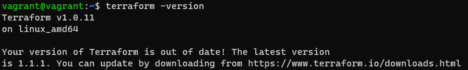
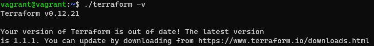

# Домашнее задание к занятию "7.1. Инфраструктура как код"

## Задача 1. Выбор инструментов. 
 
### Легенда
 
Через час совещание на котором менеджер расскажет о новом проекте. Начать работу над которым надо 
будет уже сегодня. 
На данный момент известно, что это будет сервис, который ваша компания будет предоставлять внешним заказчикам.
Первое время, скорее всего, будет один внешний клиент, со временем внешних клиентов станет больше.

Так же по разговорам в компании есть вероятность, что техническое задание еще не четкое, что приведет к большому
количеству небольших релизов, тестирований интеграций, откатов, доработок, то есть скучно не будет.  
   
Вам, как девопс инженеру, будет необходимо принять решение об инструментах для организации инфраструктуры.
На данный момент в вашей компании уже используются следующие инструменты: 
- остатки Сloud Formation, 
- некоторые образы сделаны при помощи Packer,
- год назад начали активно использовать Terraform, 
- разработчики привыкли использовать Docker, 
- уже есть большая база Kubernetes конфигураций, 
- для автоматизации процессов используется Teamcity, 
- также есть совсем немного Ansible скриптов, 
- и ряд bash скриптов для упрощения рутинных задач.  

Для этого в рамках совещания надо будет выяснить подробности о проекте, что бы в итоге определиться с инструментами:

1. Какой тип инфраструктуры будем использовать для этого проекта: изменяемый или не изменяемый?
2. Будет ли центральный сервер для управления инфраструктурой?
3. Будут ли агенты на серверах?
4. Будут ли использованы средства для управления конфигурацией или инициализации ресурсов? 
 
В связи с тем, что проект стартует уже сегодня, в рамках совещания надо будет определиться со всеми этими вопросами.

### В результате задачи необходимо

0. Ответить на четыре вопроса представленных в разделе "Легенда". 
5. Какие инструменты из уже используемых вы хотели бы использовать для нового проекта? 
6. Хотите ли рассмотреть возможность внедрения новых инструментов для этого проекта? 

Если для ответа на эти вопросы недостаточно информации, то напишите какие моменты уточните на совещании.

### Ответ:
1. ###### Какой тип инфраструктуры будем использовать для этого проекта: изменяемый или не изменяемый?
- оба варианта,так как систему необходимо развернуть + планируются частые релизы и доработками
2. ###### Будет ли центральный сервер для управления инфраструктурой?
- я бы рекоммендовал использовать без центрального сервера
3. ###### Будут ли агенты на серверах?
- я бы рекоммендовал использовать без агентов.
4. ###### Будут ли использованы средства для управления конфигурацией или инициализации ресурсов? 
- Будут, при использовании изменяемой и неизменяемой инфраструктуры, с учетом частых обновлений и последующего расширения
  логично использовать оба средства и для управления конфигурацией и для инициализации ресурсов
5. ###### Какие инструменты из уже используемых вы хотели бы использовать для нового проекта?
- Так как Terraform начал использоваться в предприятии, то предположительно это является целевым инструментом, значит Terraform будет использоваться для инициализации ресурсов, так же по причине использования внешних ресурсов в том числе для управления конфигурацией Ansible. Так же потому что есть на предприятии, и с учетом ответов на предыдущие вопросы.
6. ###### Хотите ли рассмотреть возможность внедрения новых инструментов для этого проекта?
- так как система не отлажена, и конечний ее вид не известен, то имеющихся инструментов достаточно новых инструментов не нужно.

## Задача 2. Установка терраформ. 

Официальный сайт: https://www.terraform.io/

Установите терраформ при помощи менеджера пакетов используемого в вашей операционной системе.
В виде результата этой задачи приложите вывод команды `terraform --version`.

### Ответ:

  

## Задача 3. Поддержка легаси кода. 

В какой-то момент вы обновили терраформ до новой версии, например с 0.12 до 0.13. 
А код одного из проектов настолько устарел, что не может работать с версией 0.13. 
В связи с этим необходимо сделать так, чтобы вы могли одновременно использовать последнюю версию терраформа установленную при помощи
штатного менеджера пакетов и устаревшую версию 0.12. 

В виде результата этой задачи приложите вывод `--version` двух версий терраформа доступных на вашем компьютере 
или виртуальной машине.
### Ответ:

  

