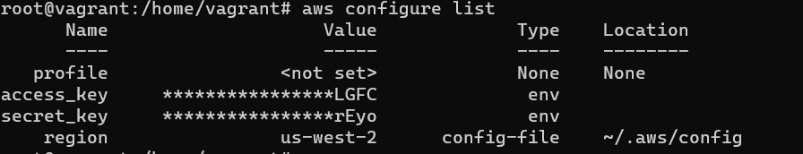

# Домашнее задание к занятию "7.2. Облачные провайдеры и синтаксис Терраформ."

Зачастую разбираться в новых инструментах гораздо интересней понимая то, как они работают изнутри. 
Поэтому в рамках первого *необязательного* задания предлагается завести свою учетную запись в AWS (Amazon Web Services).

## Задача 1. Регистрация в aws и знакомство с основами (необязательно, но крайне желательно).

Остальные задания можно будет выполнять и без этого аккаунта, но с ним можно будет увидеть полный цикл процессов. 

AWS предоставляет достаточно много бесплатных ресурсов в первых год после регистрации, подробно описано [здесь](https://aws.amazon.com/free/).
1. Создайте аккаут aws.
2. Установите c aws-cli https://aws.amazon.com/cli/.
3. Выполните первичную настройку aws-sli https://docs.aws.amazon.com/cli/latest/userguide/cli-configure-quickstart.html.
4. Создайте IAM политику для терраформа c правами
    * AmazonEC2FullAccess
    * AmazonS3FullAccess
    * AmazonDynamoDBFullAccess
    * AmazonRDSFullAccess
    * CloudWatchFullAccess
    * IAMFullAccess
5. Добавьте переменные окружения 
    ```
    export AWS_ACCESS_KEY_ID=(your access key id)
    export AWS_SECRET_ACCESS_KEY=(your secret access key)
    ```
6. Создайте, остановите и удалите ec2 инстанс (любой с пометкой `free tier`) через веб интерфейс. 

В виде результата задания приложите вывод команды `aws configure list`.

### Ответ:
<p align="center">
  
</p>


## Задача 2. Созданием ec2 через терраформ. 

1. В каталоге `terraform` вашего основного репозитория, который был создан в начале курсе, создайте файл `main.tf` и `versions.tf`.
2. Зарегистрируйте провайдер для [aws](https://registry.terraform.io/providers/hashicorp/aws/latest/docs). В файл `main.tf` добавьте
блок `provider`, а в `versions.tf` блок `terraform` с вложенным блоком `required_providers`. Укажите любой выбранный вами регион 
внутри блока `provider`.
3. Внимание! В гит репозиторий нельзя пушить ваши личные ключи доступа к аккаунта. Поэтому в предыдущем задании мы указывали
их в виде переменных окружения. 
4. В файле `main.tf` воспользуйтесь блоком `data "aws_ami` для поиска ami образа последнего Ubuntu.  
5. В файле `main.tf` создайте рессурс [ec2 instance](https://registry.terraform.io/providers/hashicorp/aws/latest/docs/resources/instance).
Постарайтесь указать как можно больше параметров для его определения. Минимальный набор параметров указан в первом блоке 
`Example Usage`, но желательно, указать большее количество параметров. 
6. Добавьте data-блоки `aws_caller_identity` и `aws_region`.
7. В файл `outputs.tf` поместить блоки `output` с данными об используемых в данный момент: 
    * AWS account ID,
    * AWS user ID,
    * AWS регион, который используется в данный момент, 
    * Приватный IP ec2 инстансы,
    * Идентификатор подсети в которой создан инстанс.  
8. Если вы выполнили первый пункт, то добейтесь того, что бы команда `terraform plan` выполнялась без ошибок. 


В качестве результата задания предоставьте:
1. Ответ на вопрос: при помощи какого инструмента (из разобранных на прошлом занятии) можно создать свой образ ami?
2. Ссылку на репозиторий с исходной конфигурацией терраформа.  

### Ответ:

1. Можно использовать CloudFormation
2. https://github.com/lozhkinav/devops-netology/tree/main/virt-homeworks/07-terraform-02-syntax
```
root@vagrant:/home/vagrant/terraform/terraform# terraform init

Initializing the backend...

Initializing provider plugins...
- Finding hashicorp/aws versions matching "~> 3.0"...
- Installing hashicorp/aws v3.70.0...
- Installed hashicorp/aws v3.70.0 (signed by HashiCorp)

Terraform has created a lock file .terraform.lock.hcl to record the provider
selections it made above. Include this file in your version control repository
so that Terraform can guarantee to make the same selections by default when
you run "terraform init" in the future.

Terraform has been successfully initialized!

You may now begin working with Terraform. Try running "terraform plan" to see
any changes that are required for your infrastructure. All Terraform commands
should now work.

If you ever set or change modules or backend configuration for Terraform,
rerun this command to reinitialize your working directory. If you forget, other
commands will detect it and remind you to do so if necessary.
root@vagrant:/home/vagrant/terraform/terraform# terraform plan

Terraform used the selected providers to generate the following execution plan. Resource actions are indicated with the
following symbols:
  + create

Terraform will perform the following actions:

  # aws_instance.web will be created
  + resource "aws_instance" "web" {
      + ami                                  = "ami-0892d3c7ee96c0bf7"
      + arn                                  = (known after apply)
      + associate_public_ip_address          = (known after apply)
      + availability_zone                    = (known after apply)
      + cpu_core_count                       = (known after apply)
      + cpu_threads_per_core                 = (known after apply)
      + disable_api_termination              = (known after apply)
      + ebs_optimized                        = (known after apply)
      + get_password_data                    = false
      + host_id                              = (known after apply)
      + id                                   = (known after apply)
      + instance_initiated_shutdown_behavior = (known after apply)
      + instance_state                       = (known after apply)
      + instance_type                        = "t3.micro"
      + ipv6_address_count                   = (known after apply)
      + ipv6_addresses                       = (known after apply)
      + key_name                             = (known after apply)
      + monitoring                           = (known after apply)
      + outpost_arn                          = (known after apply)
      + password_data                        = (known after apply)
      + placement_group                      = (known after apply)
      + placement_partition_number           = (known after apply)
      + primary_network_interface_id         = (known after apply)
      + private_dns                          = (known after apply)
      + private_ip                           = (known after apply)
      + public_dns                           = (known after apply)
      + public_ip                            = (known after apply)
      + secondary_private_ips                = (known after apply)
      + security_groups                      = (known after apply)
      + source_dest_check                    = true
      + subnet_id                            = (known after apply)
      + tags                                 = {
          + "Name" = "HelloWorld"
        }
      + tags_all                             = {
          + "Name" = "HelloWorld"
        }
      + tenancy                              = (known after apply)
      + user_data                            = (known after apply)
      + user_data_base64                     = (known after apply)
      + vpc_security_group_ids               = (known after apply)

      + capacity_reservation_specification {
          + capacity_reservation_preference = (known after apply)

          + capacity_reservation_target {
              + capacity_reservation_id = (known after apply)
            }
        }

      + ebs_block_device {
          + delete_on_termination = (known after apply)
          + device_name           = (known after apply)
          + encrypted             = (known after apply)
          + iops                  = (known after apply)
          + kms_key_id            = (known after apply)
          + snapshot_id           = (known after apply)
          + tags                  = (known after apply)
          + throughput            = (known after apply)
          + volume_id             = (known after apply)
          + volume_size           = (known after apply)
          + volume_type           = (known after apply)
        }

      + enclave_options {
          + enabled = (known after apply)
        }

      + ephemeral_block_device {
          + device_name  = (known after apply)
          + no_device    = (known after apply)
          + virtual_name = (known after apply)
        }

      + metadata_options {
          + http_endpoint               = (known after apply)
          + http_put_response_hop_limit = (known after apply)
          + http_tokens                 = (known after apply)
        }

      + network_interface {
          + delete_on_termination = (known after apply)
          + device_index          = (known after apply)
          + network_interface_id  = (known after apply)
        }

      + root_block_device {
          + delete_on_termination = (known after apply)
          + device_name           = (known after apply)
          + encrypted             = (known after apply)
          + iops                  = (known after apply)
          + kms_key_id            = (known after apply)
          + tags                  = (known after apply)
          + throughput            = (known after apply)
          + volume_id             = (known after apply)
          + volume_size           = (known after apply)
          + volume_type           = (known after apply)
        }
    }

Plan: 1 to add, 0 to change, 0 to destroy.

Changes to Outputs:
  + account_id  = "525038749290"
  + caller_arn  = "arn:aws:iam::525038749290:user/Administrator"
  + caller_user = "AIDAXUPV7QZVGWXTU7LC2"
```

