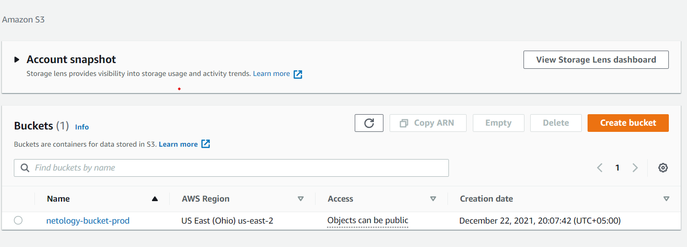

# Домашнее задание к занятию "7.3. Основы и принцип работы Терраформ"

## Задача 1. Создадим бэкэнд в S3 (необязательно, но крайне желательно).

Если в рамках предыдущего задания у вас уже есть аккаунт AWS, то давайте продолжим знакомство со взаимодействием
терраформа и aws. 

1. Создайте s3 бакет, iam роль и пользователя от которого будет работать терраформ. Можно создать отдельного пользователя,
а можно использовать созданного в рамках предыдущего задания, просто добавьте ему необходимы права, как описано 
[здесь](https://www.terraform.io/docs/backends/types/s3.html).
2. Зарегистрируйте бэкэнд в терраформ проекте как описано по ссылке выше. 


## Задача 2. Инициализируем проект и создаем воркспейсы. 

1. Выполните `terraform init`:
    * если был создан бэкэнд в S3, то терраформ создат файл стейтов в S3 и запись в таблице 
dynamodb.
    * иначе будет создан локальный файл со стейтами.  
2. Создайте два воркспейса `stage` и `prod`.
3. В уже созданный `aws_instance` добавьте зависимость типа инстанса от вокспейса, что бы в разных ворскспейсах 
использовались разные `instance_type`.
4. Добавим `count`. Для `stage` должен создаться один экземпляр `ec2`, а для `prod` два. 
5. Создайте рядом еще один `aws_instance`, но теперь определите их количество при помощи `for_each`, а не `count`.
6. Что бы при изменении типа инстанса не возникло ситуации, когда не будет ни одного инстанса добавьте параметр
жизненного цикла `create_before_destroy = true` в один из рессурсов `aws_instance`.
7. При желании поэкспериментируйте с другими параметрами и рессурсами.

В виде результата работы пришлите:
* Вывод команды `terraform workspace list`.
* Вывод команды `terraform plan` для воркспейса `prod`. 

### Ответы:

1. Список Workspace(создал так же dev для себя, и чтоб переключиться на prod)
```
root@vagrant:/home/vagrant/terraform/terraform/s3# terraform workspace list
* default

root@vagrant:/home/vagrant/terraform/terraform/s3# terraform workspace new stage
Created and switched to workspace "stage"!

You're now on a new, empty workspace. Workspaces isolate their state,
so if you run "terraform plan" Terraform will not see any existing state
for this configuration.
root@vagrant:/home/vagrant/terraform/terraform/s3# terraform workspace new prod
Created and switched to workspace "prod"!

You're now on a new, empty workspace. Workspaces isolate their state,
so if you run "terraform plan" Terraform will not see any existing state
for this configuration.
root@vagrant:/home/vagrant/terraform/terraform/s3# terraform workspace list
  default
* prod
  stage

root@vagrant:/home/vagrant/terraform/terraform/s3# terraform workspace new dev
Created and switched to workspace "dev"!

You're now on a new, empty workspace. Workspaces isolate their state,
so if you run "terraform plan" Terraform will not see any existing state
for this configuration.
root@vagrant:/home/vagrant/terraform/terraform/s3# terraform workspace list
  default
* dev
  prod
  stage
```
2. Переключение на prod:
```
root@vagrant:/home/vagrant/terraform/terraform/s3# terraform workspace select prod
Switched to workspace "prod".
root@vagrant:/home/vagrant/terraform/terraform/s3# terraform workspace list
  default
  dev
* prod
  stage
```

3. Содержимое s3.tf:
```
provider "aws" {
        region = "us-east-2"
}
resource "aws_s3_bucket" "bucket" {
  bucket = "netology-bucket-${terraform.workspace}"
  acl    = "private"
  tags = {
    Name        = "Bucket1"
    Environment = terraform.workspace
  }
}
```
4. Вывод комманд:
```
root@vagrant:/home/vagrant/terraform/terraform/s3# terraform init

Initializing the backend...

Initializing provider plugins...
- Reusing previous version of hashicorp/aws from the dependency lock file
- Using previously-installed hashicorp/aws v3.70.0

Terraform has been successfully initialized!

You may now begin working with Terraform. Try running "terraform plan" to see
any changes that are required for your infrastructure. All Terraform commands
should now work.

If you ever set or change modules or backend configuration for Terraform,
rerun this command to reinitialize your working directory. If you forget, other
commands will detect it and remind you to do so if necessary.
root@vagrant:/home/vagrant/terraform/terraform/s3# terraform plan

Terraform used the selected providers to generate the following execution plan. Resource actions are indicated with the
following symbols:
  + create

Terraform will perform the following actions:

  # aws_s3_bucket.bucket will be created
  + resource "aws_s3_bucket" "bucket" {
      + acceleration_status         = (known after apply)
      + acl                         = "private"
      + arn                         = (known after apply)
      + bucket                      = "netology-bucket-prod"
      + bucket_domain_name          = (known after apply)
      + bucket_regional_domain_name = (known after apply)
      + force_destroy               = false
      + hosted_zone_id              = (known after apply)
      + id                          = (known after apply)
      + region                      = (known after apply)
      + request_payer               = (known after apply)
      + tags                        = {
          + "Environment" = "prod"
          + "Name"        = "Bucket1"
        }
      + tags_all                    = {
          + "Environment" = "prod"
          + "Name"        = "Bucket1"
        }
      + website_domain              = (known after apply)
      + website_endpoint            = (known after apply)

      + versioning {
          + enabled    = (known after apply)
          + mfa_delete = (known after apply)
        }
    }

Plan: 1 to add, 0 to change, 0 to destroy.

───────────────────────────────────────────────────────────────────────────────────────────────────────────────────────

Note: You didn't use the -out option to save this plan, so Terraform can't guarantee to take exactly these actions if
you run "terraform apply" now.

root@vagrant:/home/vagrant/terraform/terraform/s3# terraform workspace list
  default
  dev
* prod
  stage

root@vagrant:/home/vagrant/terraform/terraform/s3# terraform apply

Terraform used the selected providers to generate the following execution plan. Resource actions are indicated with the
following symbols:
  + create

Terraform will perform the following actions:

  # aws_s3_bucket.bucket will be created
  + resource "aws_s3_bucket" "bucket" {
      + acceleration_status         = (known after apply)
      + acl                         = "private"
      + arn                         = (known after apply)
      + bucket                      = "netology-bucket-prod"
      + bucket_domain_name          = (known after apply)
      + bucket_regional_domain_name = (known after apply)
      + force_destroy               = false
      + hosted_zone_id              = (known after apply)
      + id                          = (known after apply)
      + region                      = (known after apply)
      + request_payer               = (known after apply)
      + tags                        = {
          + "Environment" = "prod"
          + "Name"        = "Bucket1"
        }
      + tags_all                    = {
          + "Environment" = "prod"
          + "Name"        = "Bucket1"
        }
      + website_domain              = (known after apply)
      + website_endpoint            = (known after apply)

      + versioning {
          + enabled    = (known after apply)
          + mfa_delete = (known after apply)
        }
    }

Plan: 1 to add, 0 to change, 0 to destroy.

Do you want to perform these actions in workspace "prod"?
  Terraform will perform the actions described above.
  Only 'yes' will be accepted to approve.

  Enter a value: yes

aws_s3_bucket.bucket: Creating...
aws_s3_bucket.bucket: Still creating... [10s elapsed]
aws_s3_bucket.bucket: Creation complete after 14s [id=netology-bucket-prod]

Apply complete! Resources: 1 added, 0 changed, 0 destroyed.
```

5. Результат в AWS :
<p align="center">
  
</p>
