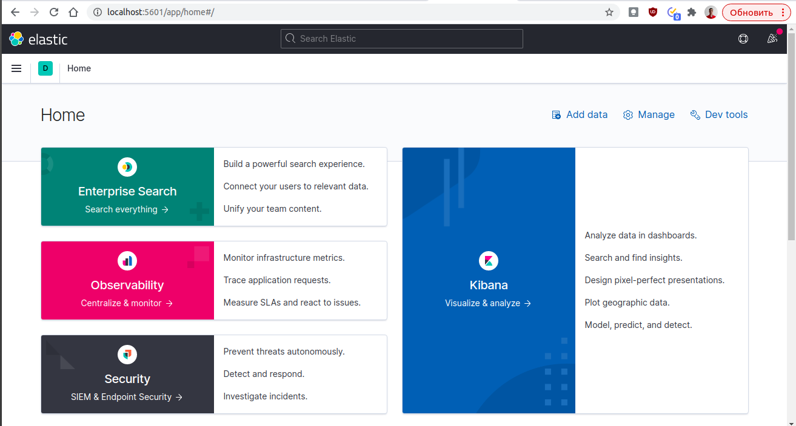
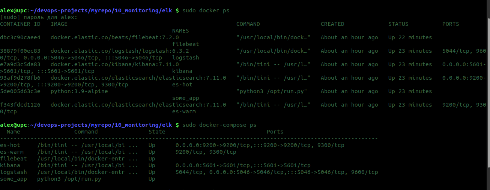
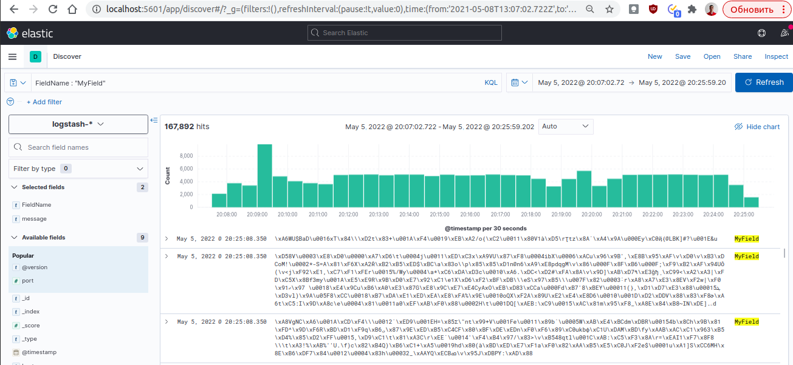
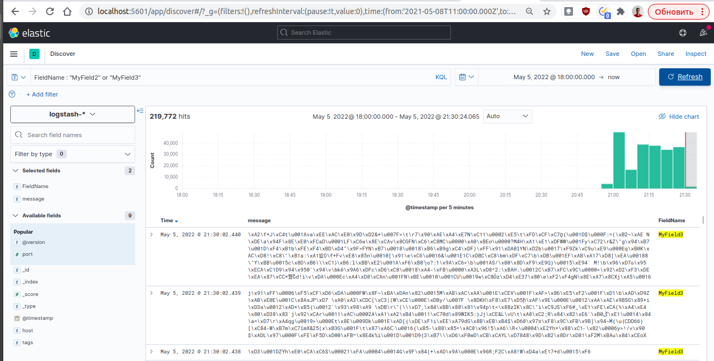
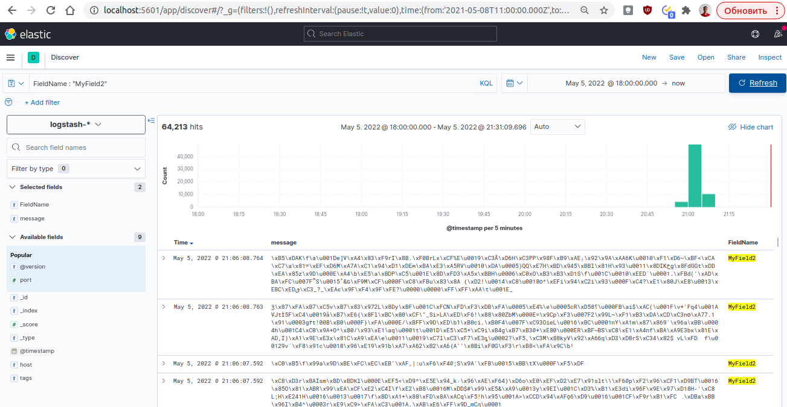
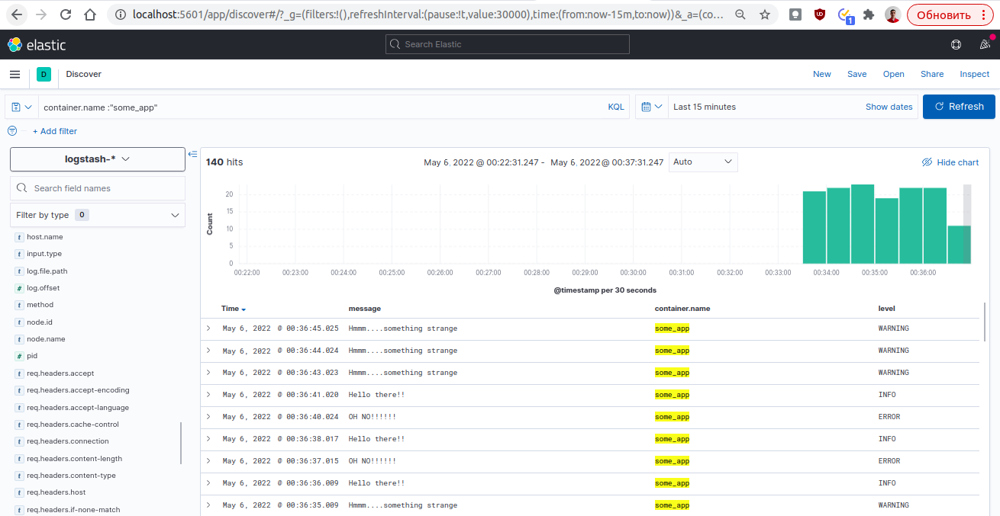
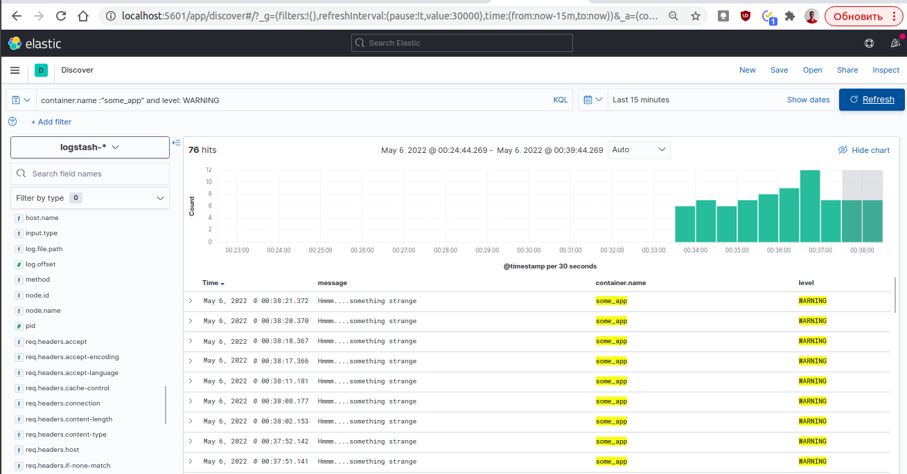
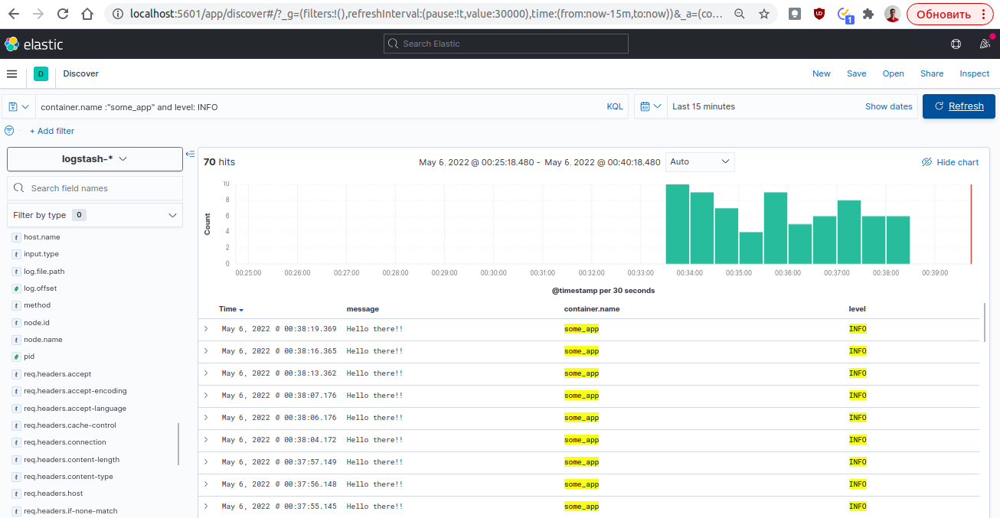
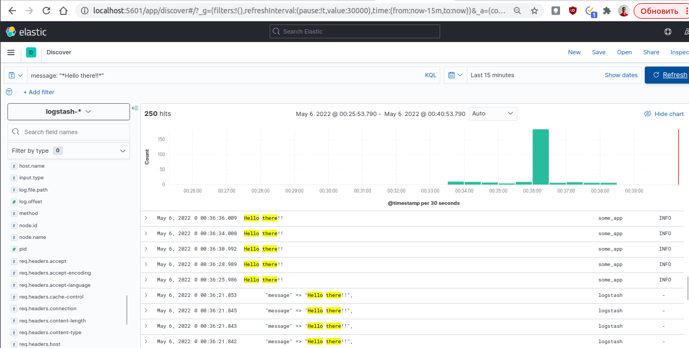

# Домашнее задание к занятию "10.04. ELK"

## Дополнительные ссылки

При выполнении задания пользуйтесь вспомогательными ресурсами:

- [поднимаем elk в докер](https://www.elastic.co/guide/en/elastic-stack-get-started/current/get-started-docker.html)
- [поднимаем elk в докер с filebeat и докер логами](https://www.sarulabs.com/post/5/2019-08-12/sending-docker-logs-to-elasticsearch-and-kibana-with-filebeat.html)
- [конфигурируем logstash](https://www.elastic.co/guide/en/logstash/current/configuration.html)
- [плагины filter для logstash](https://www.elastic.co/guide/en/logstash/current/filter-plugins.html)
- [конфигурируем filebeat](https://www.elastic.co/guide/en/beats/libbeat/5.3/config-file-format.html)
- [привязываем индексы из elastic в kibana](https://www.elastic.co/guide/en/kibana/current/index-patterns.html)
- [как просматривать логи в kibana](https://www.elastic.co/guide/en/kibana/current/discover.html)
- [решение ошибки increase vm.max_map_count elasticsearch](https://stackoverflow.com/questions/42889241/how-to-increase-vm-max-map-count)

В процессе выполнения задания могут возникнуть также не указанные тут проблемы в зависимости от системы.

Используйте output stdout filebeat/kibana и api elasticsearch для изучения корня проблемы и ее устранения.

## Задание повышенной сложности

Не используйте директорию [help](./help) при выполнении домашнего задания.

## Задание 1

Вам необходимо поднять в докере:
- elasticsearch(hot и warm ноды)
- logstash
- kibana
- filebeat

и связать их между собой.

Logstash следует сконфигурировать для приёма по tcp json сообщений.

Filebeat следует сконфигурировать для отправки логов docker вашей системы в logstash.

В директории [help](./help) находится манифест docker-compose и конфигурации filebeat/logstash для быстрого 
выполнения данного задания.

Результатом выполнения данного задания должны быть:
- скриншот `docker ps` через 5 минут после старта всех контейнеров (их должно быть 5)
- скриншот интерфейса kibana
- docker-compose манифест (если вы не использовали директорию help)
- ваши yml конфигурации для стека (если вы не использовали директорию help)

### Ответы:
<p align="center">
  
</p>
<p align="center">
  
</p>

```
alex@upc:~/devops-projects/myrepo/10_monitoring/elk $ sudo docker ps
CONTAINER ID   IMAGE                                                  COMMAND                  CREATED             STATUS          PORTS                                                           NAMES
dbc3c90caee4   docker.elastic.co/beats/filebeat:7.2.0                 "/usr/local/bin/dock…"   About an hour ago   Up 22 minutes                                                                   filebeat
38879f00ec83   docker.elastic.co/logstash/logstash:6.3.2              "/usr/local/bin/dock…"   About an hour ago   Up 23 minutes   5044/tcp, 9600/tcp, 0.0.0.0:5046->5046/tcp, :::5046->5046/tcp   logstash
e7a9d3c5da83   docker.elastic.co/kibana/kibana:7.11.0                 "/bin/tini -- /usr/l…"   About an hour ago   Up 23 minutes   0.0.0.0:5601->5601/tcp, :::5601->5601/tcp                       kibana
93af9d278fb6   docker.elastic.co/elasticsearch/elasticsearch:7.11.0   "/bin/tini -- /usr/l…"   About an hour ago   Up 23 minutes   0.0.0.0:9200->9200/tcp, :::9200->9200/tcp, 9300/tcp             es-hot
5de005d63c3e   python:3.9-alpine                                      "python3 /opt/run.py"    About an hour ago   Up 23 minutes                                                                   some_app
f343fdcd1126   docker.elastic.co/elasticsearch/elasticsearch:7.11.0   "/bin/tini -- /usr/l…"   About an hour ago   Up 23 minutes   9200/tcp, 9300/tcp                                              es-warm

alex@upc:~/devops-projects/myrepo/10_monitoring/elk $ sudo docker-compose ps
  Name                Command               State                              Ports                            
----------------------------------------------------------------------------------------------------------------
es-hot     /bin/tini -- /usr/local/bi ...   Up      0.0.0.0:9200->9200/tcp,:::9200->9200/tcp, 9300/tcp          
es-warm    /bin/tini -- /usr/local/bi ...   Up      9200/tcp, 9300/tcp                                          
filebeat   /usr/local/bin/docker-entr ...   Up                                                                  
kibana     /bin/tini -- /usr/local/bi ...   Up      0.0.0.0:5601->5601/tcp,:::5601->5601/tcp                    
logstash   /usr/local/bin/docker-entr ...   Up      5044/tcp, 0.0.0.0:5046->5046/tcp,:::5046->5046/tcp, 9600/tcp
some_app   python3 /opt/run.py              Up                                                                  

alex@upc:~/devops-projects/myrepo/10_monitoring/elk $ 
```
## Задание 2

Перейдите в меню [создания index-patterns  в kibana](http://localhost:5601/app/management/kibana/indexPatterns/create)
и создайте несколько index-patterns из имеющихся.

Перейдите в меню просмотра логов в kibana (Discover) и самостоятельно изучите как отображаются логи и как производить 
поиск по логам.

В манифесте директории help также приведенно dummy приложение, которое генерирует рандомные события в stdout контейнера.
Данные логи должны порождать индекс logstash-* в elasticsearch. Если данного индекса нет - воспользуйтесь советами 
и источниками из раздела "Дополнительные ссылки" данного ДЗ.


### Ответы:
Вывод поиска по фильтрам, добавил свое поле MyField в конфигах для отображения поиска
<p align="center">
  
</p>
<p align="center">
  
</p>
<p align="center">
  
</p>

Скрины результата в выводе при фильтрации:
<p align="center">
  
</p>
<p align="center">
  
</p>
<p align="center">
  
</p>
В том числе по тексту в MESSAGE и отображает логи из расзных контенеров:
<p align="center">
  
</p>

Файлы конфигурации и докера
[docker-compose](./docker-compose.yml)
[filebeat](./filebeat.yml)
[logstash](./logstash.conf)
[run](./run.py)
---
