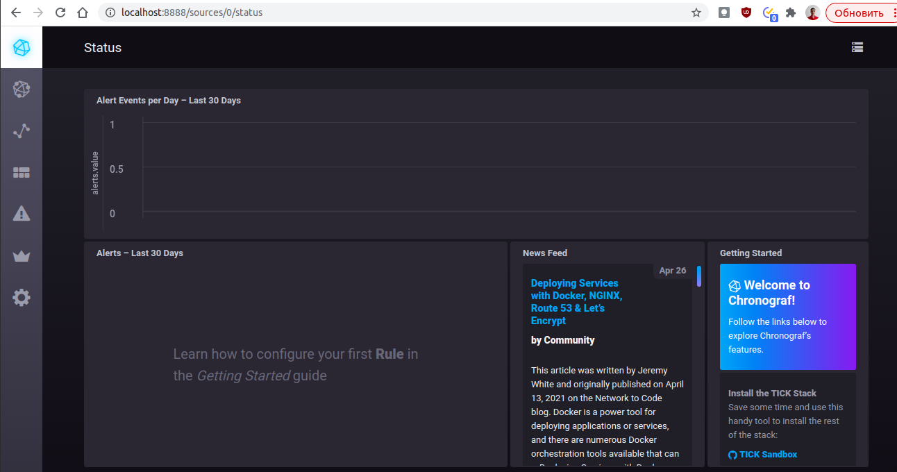
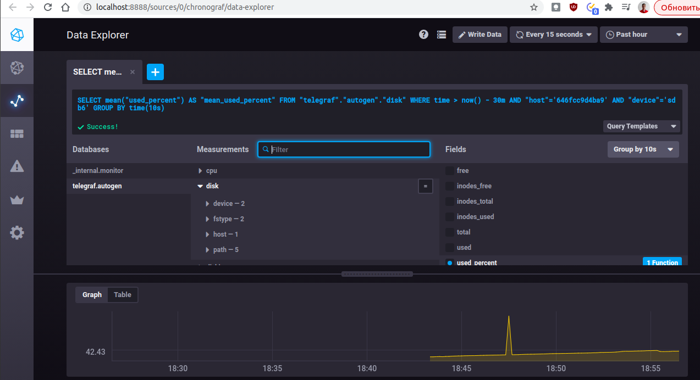
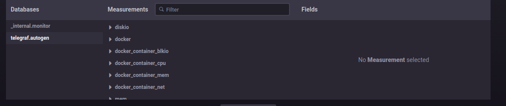
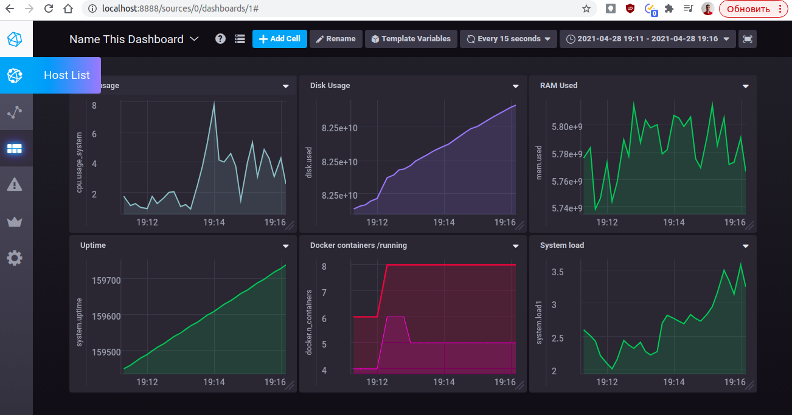

# Домашнее задание к занятию "10.02. Системы мониторинга"

## Обязательные задания

1. Опишите основные плюсы и минусы pull и push систем мониторинга.
```
если без копипаста презентации то:
PUSH - удобна для использования в динамически создаваемых машинах (например из докер-контейнеров), 
       так как в противном случае Система мониторинга должна будет узнавать о новых хостах для их опроса,
       можно задавать глубину мониторинга именно на машинах, добавление новых иснтансов автоматом добавит метрику без настройки системы мониторинга
       Передача данных в открытом виде по сети, при наличии ПД в метриках есть риск утечки данных
       так же есть риск потери данных при недоступности системы мониторинга (принимающей метрики)
       передаваться данные должны на один ресурс для сбора (одну систему мониторинга) одним источником
PULL - контроль над метриками с единой точки, возможность конеккта по SSL к агентам.
       более высокий уровень контроля за источниками метрик ,т.е. всегда известно кто откуда что передает,
       возможность ставить в Downtime (отключение алертинга) целых систем без потери передаваемых данных (хотя думаю в Push так же реализуемо)
       Ну и то что разными системами мониторинга можно получать одни и теже метрики, можно выподнять запросы метрики с изменяемой переодичностью 
       так же запрашивать метрики в ручном режиме в обход систем сбора 
       минус - неудобство для динамических машин (докер-контейнеры) нужно динамически собирать статистику о наличии машин, нужен дополнительный оркестратор
```

2. Какие из ниже перечисленных систем относятся к push модели, а какие к pull? А может есть гибридные?

    - Prometheus 
    - TICK
    - Zabbix
    - VictoriaMetrics
    - Nagios

```

Система	Тип
Prometheus:	Гибридная : одновременно опрашивает системы, так же может получать данные от агентов exporter-ов, и получать метрики о событиях
TICK	PUSH : telegraph передает информацию в систему хранилище, так же данные получает Kapasitor по Pull модели
Zabbix	PUSH : использует подключение к ресурсом по стандартным протоколам или же оправшивает сови агенты у становленные на серверах для получения данных
VictoriaMetrics	БОльше подходит PUSH, так как метрики записываются в нее, но это (если правильно понял по описанию) система для хранения по большей части, и получает данные, которые к нейпишут другие системы
Nagios	PULL : Так же использует опрос snmp, агентов, которые собирают информацию
```

3. Склонируйте себе [репозиторий](https://github.com/influxdata/sandbox/tree/master) и запустите TICK-стэк, 
используя технологии docker и docker-compose.

В виде решения на это упражнение приведите выводы команд с вашего компьютера (виртуальной машины):

    - curl http://localhost:8086/ping
    - curl http://localhost:8888
    - curl http://localhost:9092/kapacitor/v1/ping

А также скриншот веб-интерфейса ПО chronograf (`http://localhost:8888`). 

P.S.: если при запуске некоторые контейнеры будут падать с ошибкой - проставьте им режим `Z`, например
`./data:/var/lib:Z`

```
root@vagrant:/home/vagrant/devops-netology/virt-homeworks/10-monitoring-02-systems/tick_repo/TICK-docker/1.3# curl http://localhost:8086/ping -v
*   Trying 127.0.0.1:8086...
* TCP_NODELAY set
* Connected to localhost (127.0.0.1) port 8086 (#0)
> GET /ping HTTP/1.1
> Host: localhost:8086
> User-Agent: curl/7.68.0
> Accept: */*
> 
* Mark bundle as not supporting multiuse
< HTTP/1.1 204 No Content
< Content-Type: application/json
< Request-Id: 9386547f-a80f-11eb-8044-000000000000
< X-Influxdb-Version: 1.3.5
< Date: Wed, 28 Apr 2021 10:50:41 GMT
< 
* Connection #0 to host localhost left intact

root@vagrant:/home/vagrant/devops-netology/virt-homeworks/10-monitoring-02-systems/tick_repo/TICK-docker/1.3# curl http://localhost:8888 -v
*   Trying 127.0.0.1:8888...
* TCP_NODELAY set
* Connected to localhost (127.0.0.1) port 8888 (#0)
> GET / HTTP/1.1
> Host: localhost:8888
> User-Agent: curl/7.68.0
> Accept: */*
> 
* Mark bundle as not supporting multiuse
< HTTP/1.1 200 OK
< Accept-Ranges: bytes
< Cache-Control: public, max-age=3600
< Content-Length: 546
< Content-Type: text/html; charset=utf-8
< Etag: "5462923042"
< Last-Modified: Fri, 29 Sep 2017 23:00:42 GMT
< Vary: Accept-Encoding
< X-Chronograf-Version: 1.3.8.3
< Date: Wed, 28 Apr 2021 10:50:48 GMT
< 
<!DOCTYPE html>
<html>
  <head>
    <meta http-equiv="Content-type" content="text/html; charset=utf-8"/>
    <title>Chronograf</title>
  <link rel="shortcut icon" href="/favicon.ico"><link href="/chronograf.css" rel="stylesheet"></head>
  <body>
    <div id='react-root' data-basepath=""></div>
  <script type="text/javascript" src="/manifest.0b50876f6444e513725c.js"></script><script type="text/javascript" src="/vendor.36ee797884f822b1fbde.js"></script><script type="text/javascript" src="/app.3eec41dc0f57667d6ff4.js"></script></body>
</html>
* Connection #0 to host localhost left intact

root@vagrant:/home/vagrant/devops-netology/virt-homeworks/10-monitoring-02-systems/tick_repo/TICK-docker/1.3# curl http://localhost:9092/kapacitor/v1/ping -v
*   Trying 127.0.0.1:9092...
* TCP_NODELAY set
* Connected to localhost (127.0.0.1) port 9092 (#0)
> GET /kapacitor/v1/ping HTTP/1.1
> Host: localhost:9092
> User-Agent: curl/7.68.0
> Accept: */*
> 
* Mark bundle as not supporting multiuse
< HTTP/1.1 204 No Content
< Content-Type: application/json; charset=utf-8
< Request-Id: 9af33711-a80f-11eb-8033-000000000000
< X-Kapacitor-Version: 1.3.3
< Date: Wed, 28 Apr 2021 10:50:54 GMT
< 
* Connection #0 to host localhost left intact

root@vagrant:/home/vagrant/devops-netology/virt-homeworks/10-monitoring-02-systems/tick_repo/TICK-docker/1.3# 
```

4. Перейдите в веб-интерфейс Chronograf (`http://localhost:8888`) и откройте вкладку `Data explorer`.

    - Нажмите на кнопку `Add a query`
    - Изучите вывод интерфейса и выберите БД `telegraf.autogen`
    - В `measurments` выберите mem->host->telegraf_container_id , а в `fields` выберите used_percent. 
    Внизу появится график утилизации оперативной памяти в контейнере telegraf.
    - Вверху вы можете увидеть запрос, аналогичный SQL-синтаксису. 
    Поэкспериментируйте с запросом, попробуйте изменить группировку и интервал наблюдений.

Для выполнения задания приведите скриншот с отображением метрик утилизации места на диске 
(disk->host->telegraf_container_id) из веб-интерфейса.

#### Вывод интерфейса
<p align="center">
  
</p>

#### Утилизация диска
<p align="center">
  
</p>

#### Добавление плагина Docker
<p align="center">
  
</p>

#### Настроенные дашборды
<p align="center">
  
</p>
5. Изучите список [telegraf inputs](https://github.com/influxdata/telegraf/tree/master/plugins/inputs). 
Добавьте в конфигурацию telegraf следующий плагин - [docker](https://github.com/influxdata/telegraf/tree/master/plugins/inputs/docker):
```
[[inputs.docker]]
  endpoint = "unix:///var/run/docker.sock"
```

Дополнительно вам может потребоваться донастройка контейнера telegraf в `docker-compose.yml` дополнительного volume и 
режима privileged:
```
  telegraf:
    image: telegraf:1.4.0
    privileged: true
    volumes:
      - ./etc/telegraf.conf:/etc/telegraf/telegraf.conf:Z
      - /var/run/docker.sock:/var/run/docker.sock:Z
    links:
      - influxdb
    ports:
      - "8092:8092/udp"
      - "8094:8094"
      - "8125:8125/udp"
```

После настройке перезапустите telegraf, обновите веб интерфейс и приведите скриншотом список `measurments` в 
веб-интерфейсе базы telegraf.autogen . Там должны появиться метрики, связанные с docker.

Факультативно можете изучить какие метрики собирает telegraf после выполнения данного задания.

#### Добавление плагина Docker
<p align="center">
  
</p>
