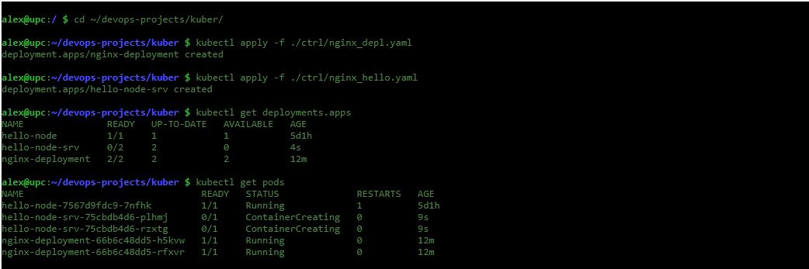
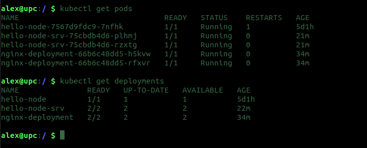
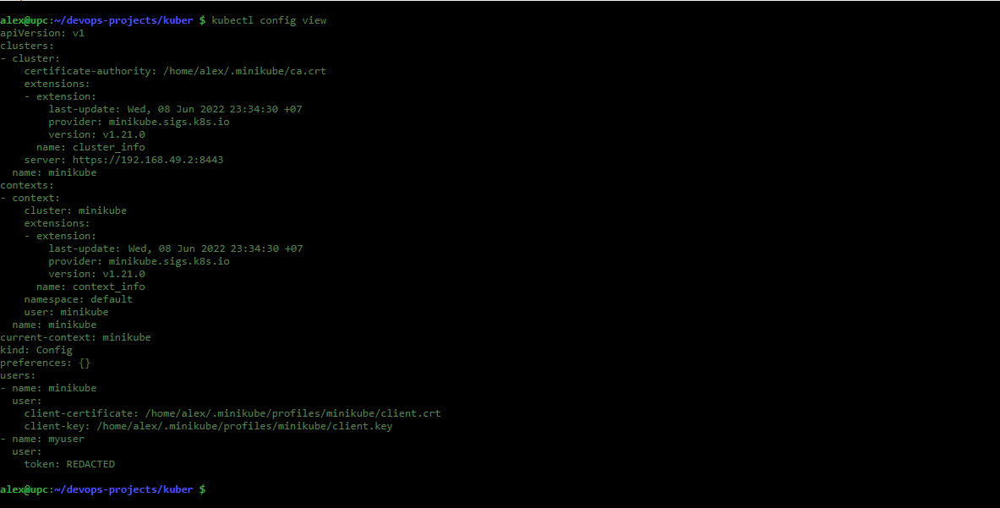
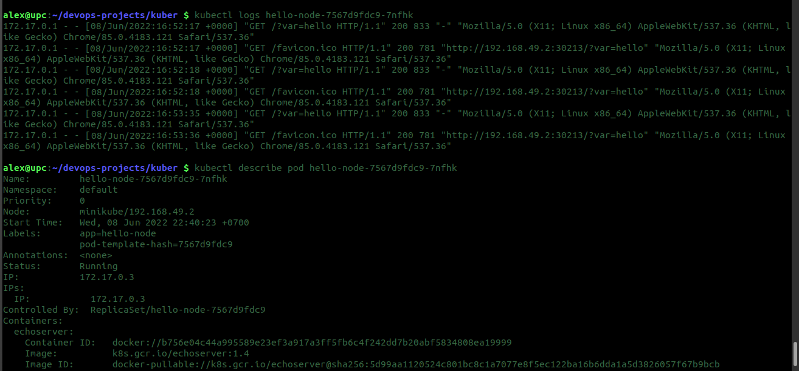
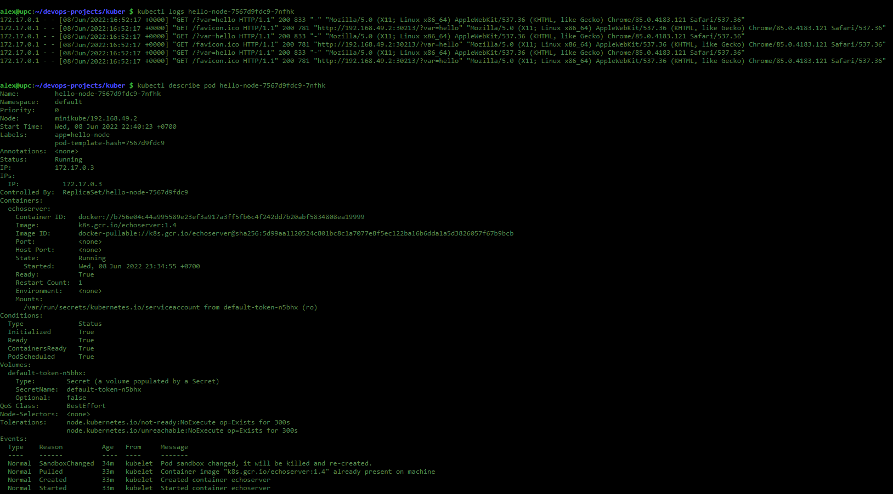
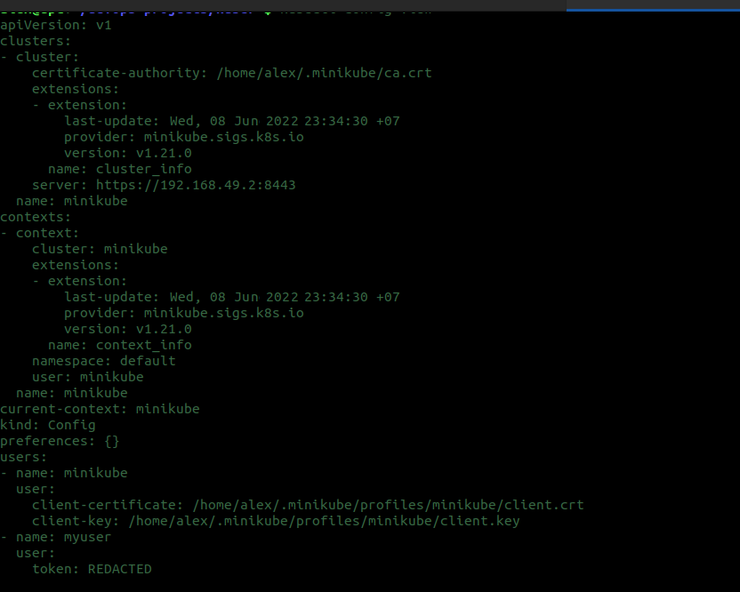
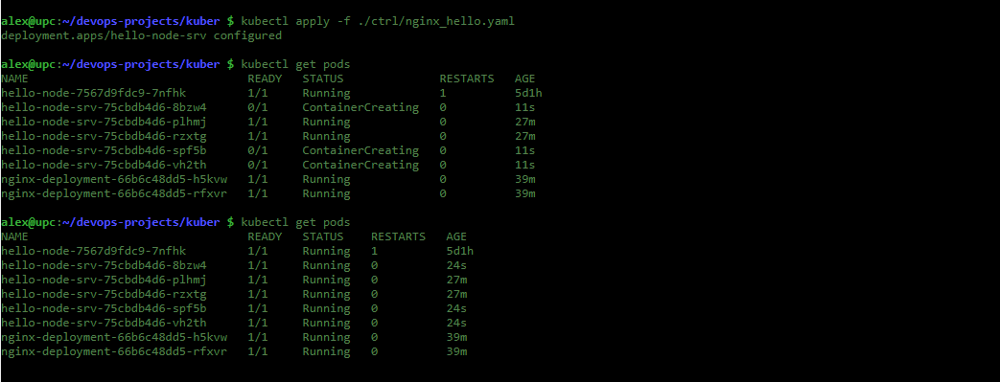
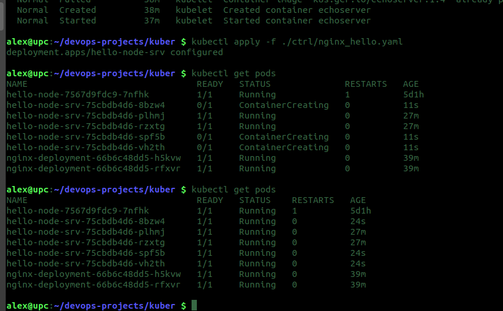

# Домашнее задание к занятию "12.2 Команды для работы с Kubernetes"
Кластер — это сложная система, с которой крайне редко работает один человек. Квалифицированный devops умеет наладить работу всей команды, занимающейся каким-либо сервисом.
После знакомства с кластером вас попросили выдать доступ нескольким разработчикам. Помимо этого требуется служебный аккаунт для просмотра логов.

## Задание 1: Запуск пода из образа в деплойменте
Для начала следует разобраться с прямым запуском приложений из консоли. Такой подход поможет быстро развернуть инструменты отладки в кластере. Требуется запустить деплоймент на основе образа из hello world уже через deployment. Сразу стоит запустить 2 копии приложения (replicas=2). 

Требования:
 * пример из hello world запущен в качестве deployment
 * количество реплик в deployment установлено в 2
 * наличие deployment можно проверить командой kubectl get deployment
 * наличие подов можно проверить командой kubectl get pods

### Ответы:

Установил kubelet и kubeadm,  kubectl установлен в прошлом ДЗ [12.1](https://github.com/lozhkinav/devops-netology/blob/main/virt-homeworks/12-kubernetes-01-intro/README.md)
запустил Deployments

  

Сначала сделал по инструкции [ТУТ](https://kubernetes.io/docs/concepts/workloads/controllers/deployment/)
потом повторил для hello-world

- Скрин работы команды

  

## Задание 2: Просмотр логов для разработки
Разработчикам крайне важно получать обратную связь от штатно работающего приложения и, еще важнее, об ошибках в его работе. 
Требуется создать пользователя и выдать ему доступ на чтение конфигурации и логов подов в app-namespace.

Требования: 
 * создан новый токен доступа для пользователя
 * пользователь прописан в локальный конфиг (~/.kube/config, блок users)
 * пользователь может просматривать логи подов и их конфигурацию (kubectl logs pod <pod_id>, kubectl describe pod <pod_id>)

### Ответы:

Конфиг пользователя:

  

- Скрин работы команды

  

Просмотр логов (работоспособность команд):

  

- Скрин работы команды

  

## Задание 3: Изменение количества реплик 
Поработав с приложением, вы получили запрос на увеличение количества реплик приложения для нагрузки. Необходимо изменить запущенный deployment, увеличив количество реплик до 5. Посмотрите статус запущенных подов после увеличения реплик. 

Требования:
 * в deployment из задания 1 изменено количество реплик на 5
 * проверить что все поды перешли в статус running (kubectl get pods)

### Ответы:

Реплики изменены, результаты в процессе применения

  

- Скрин работы команды

  

