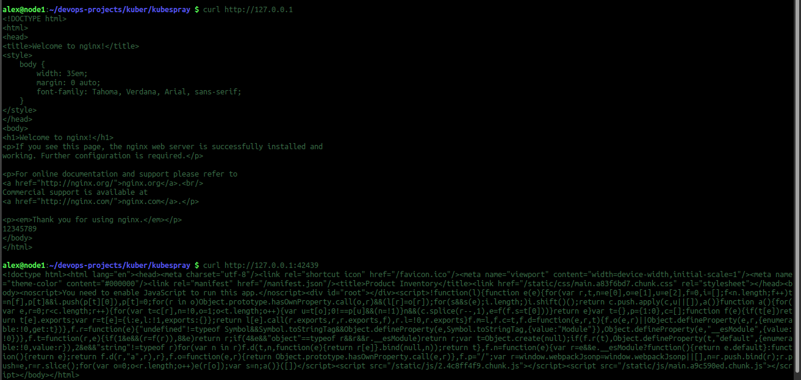
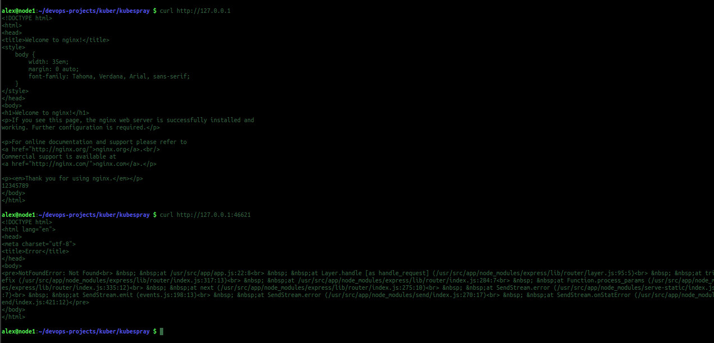

# Домашнее задание к занятию "13.3 работа с kubectl"
## Задание 1: проверить работоспособность каждого компонента
Для проверки работы можно использовать 2 способа: port-forward и exec. Используя оба способа, проверьте каждый компонент:
* сделайте запросы к бекенду;
* сделайте запросы к фронту;
* подключитесь к базе данных.

### Ответы:

* Используем конфигурацию подов из предыдущих работ

```
alex@node1:~/devops-projects/myrepo/13_kuberconfig/1 $ sudo kubectl get all
NAME                                      READY   STATUS             RESTARTS   AGE
pod/nfs-server-nfs-server-provisioner-0   0/1     CrashLoopBackOff   457        5d18h
pod/prod-b-v2-69cbf87889-gsfb8            1/1     Running            1          5d19h
pod/prod-b-v2-69cbf87889-q29bx            1/1     Running            1          5d19h
pod/prod-f-v2-596886c7c-nm62r             1/1     Running            2          5d19h

NAME                                        TYPE        CLUSTER-IP     EXTERNAL-IP   PORT(S)                                                                                                     AGE
service/nfs-server-nfs-server-provisioner   ClusterIP   10.233.9.182   <none>        2049/TCP,2049/UDP,32803/TCP,32803/UDP,20048/TCP,20048/UDP,875/TCP,875/UDP,111/TCP,111/UDP,662/TCP,662/UDP   5d20h
service/prod-b-v2                           NodePort    10.233.59.30   <none>        8080:31667/TCP                                                                                              5d19h
service/prod-f-v2                           NodePort    10.233.4.114   <none>        8080:30799/TCP                                                                                              5d19h

NAME                        READY   UP-TO-DATE   AVAILABLE   AGE
deployment.apps/prod-b-v2   2/2     2            2           5d19h
deployment.apps/prod-f-v2   1/1     1            1           5d19h

NAME                                   DESIRED   CURRENT   READY   AGE
replicaset.apps/prod-b-v2-69cbf87889   2         2         2       5d19h
replicaset.apps/prod-f-v2-596886c7c    1         1         1       5d19h

NAME                                                 READY   AGE
statefulset.apps/nfs-server-nfs-server-provisioner   0/1     5d20h
```
* Выполним проверку Фронта через Port-Forward
* Выполним перенаправление :
```
alex@node1:~/devops-projects/myrepo/13_kuberconfig/1 $ sudo kubectl port-forward deployment/prod-f-v2 :8080
Forwarding from 127.0.0.1:42439 -> 8080
Forwarding from [::1]:42439 -> 8080
Handling connection for 42439
Handling connection for 42439
```
* Выполним CURL:
<p align="center">
  
</p>

* Выполним проверку Бэка
```
alex@node1:~/devops-projects/myrepo/13_kuberconfig/1 $ sudo kubectl port-forward deployment/prod-b-v2 :8080
Forwarding from 127.0.0.1:46621 -> 8080
Forwarding from [::1]:46621 -> 8080
```
* Выполним CURL:
<p align="center">
  
</p>

## Задание 2: ручное масштабирование

При работе с приложением иногда может потребоваться вручную добавить пару копий. Используя команду kubectl scale, попробуйте увеличить количество бекенда и фронта до 3. Проверьте, на каких нодах оказались копии после каждого действия (kubectl describe, kubectl get pods -o wide). После уменьшите количество копий до 1.

### Ответы:

```
alex@node1:~/devops-projects $ sudo kubectl get all
NAME                                      READY   STATUS              RESTARTS   AGE
pod/nfs-server-nfs-server-provisioner-0   0/1     CrashLoopBackOff    462        5d19h
pod/postgres-0                            0/1     ContainerCreating   0          15m
pod/prod-b-5cbd9dd478-4bllp               1/1     Running             0          7m1s
pod/prod-b-5cbd9dd478-plmqq               1/1     Running             0          7m1s
pod/prod-f-d6d69db49-v4gh9                1/1     Running             0          7m1s
```

* Масштабирование до 3х:

```
alex@node1:~/devops-projects/kuber/kubespray $ sudo kubectl scale --replicas=3 deployment/prod-b
deployment.apps/prod-b scaled

alex@node1:~/devops-projects/kuber/kubespray $ sudo kubectl scale --replicas=3 deployment/prod-f
deployment.apps/prod-f scaled

alex@node1:~/devops-projects/kuber/kubespray $ sudo kubectl get pods
NAME                                  READY   STATUS              RESTARTS   AGE
nfs-server-nfs-server-provisioner-0   0/1     Error               463        5d19h
postgres-0                            0/1     ContainerCreating   0          16m
prod-b-5cbd9dd478-26w6g               1/1     Running             0          14s
prod-b-5cbd9dd478-4bllp               1/1     Running             0          8m17s
prod-b-5cbd9dd478-plmqq               1/1     Running             0          8m17s
prod-f-d6d69db49-pm55s                0/1     ContainerCreating   0          11s
prod-f-d6d69db49-v4gh9                1/1     Running             0          8m17s
prod-f-d6d69db49-w4vtb                0/1     ContainerCreating   0          11s

alex@node1:~/devops-projects/kuber/kubespray $ sudo kubectl get pods
NAME                                  READY   STATUS              RESTARTS   AGE
nfs-server-nfs-server-provisioner-0   0/1     CrashLoopBackOff    463        5d19h
postgres-0                            0/1     ContainerCreating   0          16m
prod-b-5cbd9dd478-26w6g               1/1     Running             0          33s
prod-b-5cbd9dd478-4bllp               1/1     Running             0          8m36s
prod-b-5cbd9dd478-plmqq               1/1     Running             0          8m36s
prod-f-d6d69db49-pm55s                1/1     Running             0          30s
prod-f-d6d69db49-v4gh9                1/1     Running             0          8m36s
prod-f-d6d69db49-w4vtb                1/1     Running             0          30s

alex@node1:~/devops-projects/kuber/kubespray $ 


alex@node1:~/devops-projects/kuber/kubespray $ sudo kubectl describe deployment/prod-b
Name:                   prod-b
Namespace:              policy-my
CreationTimestamp:      Thu, 18 Aug 2022 20:30:52 +0700
Labels:                 app=ecommerce
                        tier=back
Annotations:            deployment.kubernetes.io/revision: 1
Selector:               app=ecommerce,tier=back
Replicas:               3 desired | 3 updated | 3 total | 3 available | 0 unavailable
StrategyType:           RollingUpdate
MinReadySeconds:        0
RollingUpdateStrategy:  25% max unavailable, 25% max surge
Pod Template:
  Labels:  app=ecommerce
           tier=back
  Containers:
   prod-b:
    Image:      chrischinchilla/humanitech-product-be
    Port:       8080/TCP
    Host Port:  0/TCP
    Environment:
      DATABASE_HOST:      postgres
      DATABASE_NAME:      prod-db
      DATABASE_PASSWORD:  postgres
      DATABASE_USER:      postgres
      DATABASE_PORT:      5432
    Mounts:               <none>
  Volumes:                <none>
Conditions:
  Type           Status  Reason
  ----           ------  ------
  Progressing    True    NewReplicaSetAvailable
  Available      True    MinimumReplicasAvailable
OldReplicaSets:  <none>
NewReplicaSet:   prod-b-5cbd9dd478 (3/3 replicas created)
Events:
  Type    Reason             Age    From                   Message
  ----    ------             ----   ----                   -------
  Normal  ScalingReplicaSet  11m    deployment-controller  Scaled up replica set prod-b-5cbd9dd478 to 2
  Normal  ScalingReplicaSet  3m39s  deployment-controller  Scaled up replica set prod-b-5cbd9dd478 to 3


alex@node1:~/devops-projects/kuber/kubespray $ sudo kubectl describe deployment/prod-f
Name:                   prod-f
Namespace:              policy-my
CreationTimestamp:      Thu, 18 Aug 2022 20:30:52 +0700
Labels:                 <none>
Annotations:            deployment.kubernetes.io/revision: 1
Selector:               app=ecommerce,tier=front
Replicas:               3 desired | 3 updated | 3 total | 3 available | 0 unavailable
StrategyType:           RollingUpdate
MinReadySeconds:        0
RollingUpdateStrategy:  25% max unavailable, 25% max surge
Pod Template:
  Labels:  app=ecommerce
           tier=front
  Containers:
   client:
    Image:      chrischinchilla/humanitech-product-fe
    Port:       8080/TCP
    Host Port:  0/TCP
    Environment:
      PRODUCT_BACK_SERVER_URL:  product-b
    Mounts:                     <none>
  Volumes:                      <none>
Conditions:
  Type           Status  Reason
  ----           ------  ------
  Progressing    True    NewReplicaSetAvailable
  Available      True    MinimumReplicasAvailable
OldReplicaSets:  <none>
NewReplicaSet:   prod-f-d6d69db49 (3/3 replicas created)
Events:
  Type    Reason             Age   From                   Message
  ----    ------             ----  ----                   -------
  Normal  ScalingReplicaSet  12m   deployment-controller  Scaled up replica set prod-f-d6d69db49 to 1
  Normal  ScalingReplicaSet  4m7s  deployment-controller  Scaled up replica set prod-f-d6d69db49 to 3
```

* Устанавливаем по 1й реплике:

```
alex@node1:~/devops-projects/kuber/kubespray $ sudo kubectl scale --replicas=1 deployment/prod-f
deployment.apps/prod-f scaled

alex@node1:~/devops-projects/kuber/kubespray $ sudo kubectl describe deployment/prod-f
Name:                   prod-f
Namespace:              policy-my
CreationTimestamp:      Thu, 18 Aug 2022 20:30:52 +0700
Labels:                 <none>
Annotations:            deployment.kubernetes.io/revision: 1
Selector:               app=ecommerce,tier=front
Replicas:               1 desired | 1 updated | 1 total | 1 available | 0 unavailable
StrategyType:           RollingUpdate
MinReadySeconds:        0
RollingUpdateStrategy:  25% max unavailable, 25% max surge
Pod Template:
  Labels:  app=ecommerce
           tier=front
  Containers:
   client:
    Image:      chrischinchilla/humanitech-product-fe
    Port:       8080/TCP
    Host Port:  0/TCP
    Environment:
      PRODUCT_BACK_SERVER_URL:  product-b
    Mounts:                     <none>
  Volumes:                      <none>
Conditions:
  Type           Status  Reason
  ----           ------  ------
  Progressing    True    NewReplicaSetAvailable
  Available      True    MinimumReplicasAvailable
OldReplicaSets:  <none>
NewReplicaSet:   prod-f-d6d69db49 (1/1 replicas created)
Events:
  Type    Reason             Age   From                   Message
  ----    ------             ----  ----                   -------
  Normal  ScalingReplicaSet  13m   deployment-controller  Scaled up replica set prod-f-d6d69db49 to 1
  Normal  ScalingReplicaSet  5m5s  deployment-controller  Scaled up replica set prod-f-d6d69db49 to 3
  Normal  ScalingReplicaSet  5s    deployment-controller  Scaled down replica set prod-f-d6d69db49 to 1
```
```
alex@node1:~/devops-projects/kuber/kubespray $ sudo kubectl scale --replicas=1 deployment/prod-b
deployment.apps/prod-b scaled

alex@node1:~/devops-projects/kuber/kubespray $ sudo kubectl describe deployment/prod-b
Name:                   prod-b
Namespace:              policy-my
CreationTimestamp:      Thu, 18 Aug 2022 20:30:52 +0700
Labels:                 app=ecommerce
                        tier=back
Annotations:            deployment.kubernetes.io/revision: 1
Selector:               app=ecommerce,tier=back
Replicas:               1 desired | 1 updated | 1 total | 1 available | 0 unavailable
StrategyType:           RollingUpdate
MinReadySeconds:        0
RollingUpdateStrategy:  25% max unavailable, 25% max surge
Pod Template:
  Labels:  app=ecommerce
           tier=back
  Containers:
   prod-b:
    Image:      chrischinchilla/humanitech-product-be
    Port:       8080/TCP
    Host Port:  0/TCP
    Environment:
      DATABASE_HOST:      postgres
      DATABASE_NAME:      prod-db
      DATABASE_PASSWORD:  postgres
      DATABASE_USER:      postgres
      DATABASE_PORT:      5432
    Mounts:               <none>
  Volumes:                <none>
Conditions:
  Type           Status  Reason
  ----           ------  ------
  Progressing    True    NewReplicaSetAvailable
  Available      True    MinimumReplicasAvailable
OldReplicaSets:  <none>
NewReplicaSet:   prod-b-5cbd9dd478 (1/1 replicas created)
Events:
  Type    Reason             Age    From                   Message
  ----    ------             ----   ----                   -------
  Normal  ScalingReplicaSet  14m    deployment-controller  Scaled up replica set prod-b-5cbd9dd478 to 2
  Normal  ScalingReplicaSet  6m12s  deployment-controller  Scaled up replica set prod-b-5cbd9dd478 to 3
  Normal  ScalingReplicaSet  5s     deployment-controller  Scaled down replica set prod-b-5cbd9dd478 to 1
```